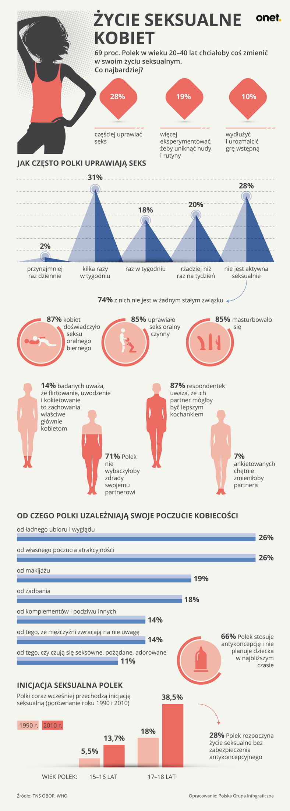
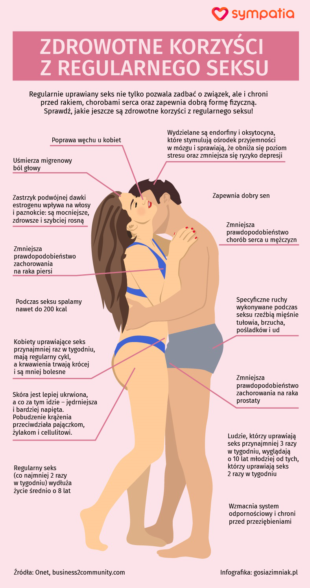

https://kobieta.onet.pl/brak-seksu-w-zwiazku-biale-malzenstwo-niskie-libido-oczami-mezczyzny-listy-do-onetu/716nbl0

Brak seksu w związku oczami mężczyzny [Listy do Onetu]

2019-01-15T12:55:00+01:00

Mój przypadek jest chyba banalny – dwa lata z dziewczyną, wspólne zamieszkanie, dziecko. Problemy z seksem zaczęły się w ciąży. "Jest mi niedobrze", "trzeba uważać na dziecko" - słyszałem. Seksu było mało, ale rozumiałem ten szczególny okres i nie ponaglałem. Po porodzie pojawiły się nowe obowiązki,brak czasu, zmęczenie. Moje miejsce zajęło dziecko, a ja zostałem w związku tym trzecim. Partnerka zaczęła wydawać komendy: "wyrzuć pieluszki", "kup mleko", "trzeba powiesić półkę"...

Po pół roku dziecko poszło do żłobka, a partnerka wróciła do pracy. Pomagałem przy dziecku, pomagałem w domu. Seksu było mało. Jakoś też nie odczuwałem, by ona była tak szczerze nim zainteresowana.

Pewnego dnia postanowiłem zrobić eksperyment - a mianowicie przestałem inicjować seks, czekając aż któregoś dnia zrobi to partnerka. I tak mijały dni, tygodnie, aż w końcu i miesiące... Jej widocznie seks nie interesował. Słuchałem opowieści o "ckliwych piersiach podczas karmienia". Słuchałem jak musi "spuścić sobie mleko, by jej nabrzmiałe piersi przestały boleć". No ale jak mężczyzna ma nabrzmiałe (przepraszam) jądra, to nikogo to nie interesuje. Seksu nie było w ogóle - a ja go nie inicjowałem, bo partnerka nie miała ochoty.

I tak sobie zdałem sprawę, że tak naprawdę kobiety chyba nie przepadają zbytnio za seksem. Nastoletnia dziewczyna nie chce współżyć z chłopakiem bo "jest za młoda".

Potem nie chce współżyć bo "szuka męża, a nie zabawy".

Potem nie chce współżyć, bo się boi, żeby kandydat na męża nie pomyślał o niej negatywnie.

Potem jest seks, miły, przyjemny przez krótką chwilę.

Potem znowu nie ma, bo pojawia się dziecko. A jak mężczyzna prosi, to słyszy "ty zboczeńcu". Mężczyzna jest potrzebny do noszenia ciężkich toreb z zakupami, ciężkich walizek na wakacjach, naprawienia różnych rzeczy w domu.

Gdyby kobiety lubiły seks, to na świecie nie byłoby prostytucji.

Gdyby kobiety lubiły seks, to same by go inicjowały, lub przynajmniej byłyby skłonne do flirtu , ale ten najczęściej ucinają.

Owszem, kobiety lubią usłyszeć miłe słowo od kolegi z pracy, ale gdy ten kolega poprosi o coś konkretnego to następuję bardzo konkretna odmowa. Kobieta lubi być adorowana, ale niczego w zamian dać już nie chce.

Zacząłem się przygotowywać do odejścia... Wiem jakie jest "równouprawnienie" w sądach, jeśli chodzi o opiekę nad dzieckiem. Zapisałem dziecko na różne zajęcia i je opłacałem. Gdy spotykaliśmy się ze znajomymi, prosiłem ich by robili nam (mi i dziecku) zdjęcia. Odbierałem dziecko z przedszkola (zresztą wcześniej też zawsze to robiłem). Kupowałem zabawki edukacyjne, książeczki.

Któregoś dnia powiedziałem partnerce, że odchodzę. Nie mogła uwierzyć. Przecież wszystko było pięknie ułożone. A ja byłem takim dobrym ojcem. W sądzie rozprawa dotyczyła tylko opieki nad dzieckiem. Chciałem sprawiedliwego podziału. Jeden tydzień u mnie, jeden u partnerki. Pani sędzia nie miała możliwości się nie zgodzić: świadkowie nie mogli zaprzeczyć, że jestem dobrym ojcem. Do tego miałem twarde dowody w postaci rachunków za opłacanie przedszkola, za zabawki, odzież, za wakacje (bo to ja płaciłem). Partnerka nagle zdała sobie sprawę, że odchodzi od niej nienajgorszy facet. Próbowała mnie zatrzymać. Pojawiła się dobrze mi znana kobieca taktyka - uwodzenie mężczyzny urodą. Ale ja byłem już niewzruszony. Odszedłem, zostawiłem ją.

Kobiety często proszą mnie o różnego rodzaju pomoc. Denerwuje mnie, kiedy jakaś koleżanka nie odzywa się miesiąc, a potem dzwoni i w drugim zdaniu mówi, że skoro mam samochód, to może bym jej pomógł coś przewieźć. Albo koleżanka w pracy prosi o przesunięcie jej biurka, bo to ja jestem mężczyzną. Teraz na zimno odpowiadam, że przecież jesteśmy sobie równi, jest równouprawnienie.

Po raz pierwszy skusiłem się, gdy byłem na wyjeździe służbowym w Berlinie. Tak jakoś w internecie znalazłem strony z dziewczynami świadczącymi usługi prostytucji. Jest tam dużo takich dziewczyn, szczególnie z Ameryki Południowej, Wenezueli, Kolumbii czy Argentyny.

Umówiłem się na seks za pieniądze i było miło. Poczułem znowu co znaczy fajny seks. Owszem bez uczucia, ale może tak jest lepiej?! Do Berlina jeździłem służbowy kilka razy i za każdym razem spotykałem się z jakąś prostytutką. I zawsze było bardzo fajnie. Nie było "bólu głowy", nie było kobiecej dezaprobaty, nie było pretensji o "niewyrzucone śmieci", "niewymienione żarówki", niezatankowany bak". Były tylko spotkania na sam seks. Odzyskałem radość z seksu.

Znalazłem sobie partnerkę na seks przez internet (tu w Polsce). Dziewczynę, która zgodziła się na taki układ, by rozwiązać swoje problemy finansowe. Pierwszy raz spotkaliśmy się na seks w hotelu. Została na całą noc. Było miło. Bez zobowiązań. Potem znowu umówiliśmy się na całą noc w hotelu. A potem przyjeżdżała do mnie dwa razy w tygodniu. W tygodniu na szybkie spotkanie, w weekend na całą noc. Spotykaliśmy się na zwykły seks (...) Chyba go ze mną lubiła, czułem, że było jej przyjemnie. Po jakimś czasie mnie zostawiła, bo poznała chłopaka. Ale ja w ten sam sposób znalazłem kolejną kobietę.

Tych dziewczyn przez te dobrych już parę lat było kilka. Niektóre z nich mają konta na Facebooku czy Instagramie. Widzę co teraz robią. Wrzucają do sieci zdjęcia pokazujące, jakie ich życie jest piękne, jakie śliczne mają bobaski. Ich partnerzy/mężowie cieszą się, i nie wiedza, że te same dziewczyny uprawiały seks za pieniądze dosłownie rok czy dwa lata temu.

Ostatnią dziewczynę poznałem na ulicy. Sprzedawała latem owoce. Kupiłem od niej wiśnie. Była naprawdę w moim typie. Wróciłem do samochodu, wtedy coś mnie tknęło. Przejechałem samochodem obok niej, zauważyła mnie. Zaparkowałem. Wróciłem. Dała mi swój numer telefonu. Potem trochę rozmów na Whatsapp'ie. Zgodziła się. Spotykamy się pół roku. Przychodzi do mnie, gdy nie mam opieki nad dzieckiem. Płacę jej miesięcznie. W bezpieczne dni, kocham się z nią, przygniatam ją mną, a później zasypiam w niej. Bardzo ją lubię. Mam nadzieję, że ona mnie też. Seks chyba jej się podoba (...) Na wiosnę planuję ją zabrać na wakacje. Cieszę się, że ją poznałem - jest najfajniejsza z tych wszystkich dziewczyn. Ale wszystkie z nich były sympatyczne.

Mam teraz ciszę i spokój. Mam piękny seks. Z piękną dziewczyną. Jest drobna, ma piękne szczupłe nogi, śliczne włosy i oczy. I usta. Drobne piersi. Jest inteligenta, zainteresowana różnymi tematami. Pyta mnie o wiele spraw. Jest też cudowna w łóżku. Kocham się z nią kochać. Gdy wracam myślami do byłej partnerki, do jej sposobu bycia "wynieś śmieci", "zrób zakupy", tak bardzo się cieszę, że zdobyłem się na odwagę i że teraz jestem wolnym mężczyzną, który odnalazł spokój ducha, i który znowu potrafi się cieszyć pięknym seksem. Taka to moja opowieść.

Zgadzam się, że dwie strony muszą się starać i iść na kompromisy. Ja poszedłem na kompromis. Ale seksu z partnerką po zajściu w ciążę było bardzo mało albo w ogóle. Po urodzinach dziecka tym bardziej. Byłem wyrozumiały. Czekałem.

Ale jej po prostu było wygodniej tego seksu nie mieć. Nie lubię retoryki typu "kobieta nie chce seksu, więc to wina faceta, który się nie stara". Czekałem, ale jednego dnia powiedziałem dosyć i odszedłem od partnerki. Być może ucierpiało na tym dziecko, ale ten model który mam, czyli dziecko na tydzień u każdego z rodzica jest dobry, bo również ojciec widuje się z dzieckiem w normalne dni, pomaga w codziennym życiu, odrabia lekcje, kładzie spać, przygotowuje śniadania – a nie wizyty kilkugodzinne w weekend, żeby zabrać je do "pizzerii".

Wiem, że byłej partnerce jest teraz gorzej. Musiała zmienić mieszkanie na mniejsze. Nie ma samochodu, więc nie może teraz zrobić większych zakupów czy zabrać dziecka gdzieś. Nie ma faceta w domu, który jej pomoże np. zmontować mebel. Ale mnie to nie interesuje. Miała fajnego faceta - ale przez swoje podejście go straciła. I jeszcze mam w pamięci jej słowa, w których porównywała mnie do mężów jej koleżanek, którzy mają większe samochody czy większe mieszkania. Niech mają, niech pracują. Ja dawałem co mogłem, ale mam wrażenie że kobietom zawsze niestety mało.

Mam teraz poukładany świat, i spokój ducha. Poświęcam się dziecku. Pracuję. Mam liczne zainteresowania. I jako mężczyzna czuję się odprężony mając te piękne chwile, kiedy kocham się fizycznie z kobietą. Nie chciałbym wracać za żadne skarby do partnerki, bo znowu byłby brak seksu, i narzekania na "niewyrzucone śmieci" czy inne bzdury.

