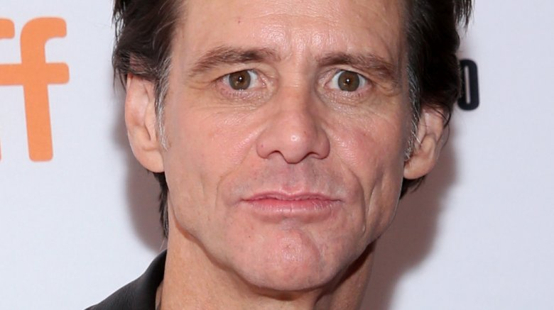

#Jim Carrey's tragic real-life story

By Stassi Reid/April 10, 2018 10:18 EST/Updated: Nov. 8, 2019 3:30 pm EST

Jim Carrey's wild personality, kooky facial expressions, and outlandish sense of humor have been making the world chuckle since the '80s. After snagging a gig on The Tonight Show at the age of 21, he parlayed his newfound success into a recurring spot on the '90s sketch comedy show In Living Color. He tickled our funny bones as he depicted memorable characters, such as Fire Marshall Bill and the buff bodybuilder Vera de Milo, and it was clear as day that Carrey had no limit to how far he would go to bring laughter into his fans' lives.

Box office success soon followed, with movies such as Ace Ventura: Pet Detective and Dumb and Dumber, but despite his accomplishments, he has struggled with inner turmoil that manifested itself during his childhood and wreaked havoc in his life well into his adult years. This is the tragic real-life story of Jim Carrey. 

## He grew up terrified that the Grim Reaper would come for his parents

Jim Carrey grew up grappling with a fear that his parents, who were "heavy smokers" weren't going to survive. "I remember locking myself in the bathroom and crying because I thought they were going to die. They banged on the door, telling me to come out. I don't know if I got over that fear at that time; it was just kind of with me," he told The Hollywood Reporter. His fears heightened as his mom freely talked about her own mortality. "I remember being seven years old and my mother at the dinner table saying things like, 'My brain is deteriorating at an incredible rate!' or 'My angina's acting up; I could go at any time!'" he recalled. "Things like that would just shake me to the core."

Those tragic childhood circumstances inspired Carrey to pen 2013 children's book, How Roland Rolls, which tackles some of the serious topics that affect young people. "One of the things I've always wanted to talk about or deal with is the fact that kids have profound feelings and profound questions that people don't give them credit for. They think about life and death and 'What happens when something happens to Mom? What happens when something happens to me?'"

Carrey eventually came to grips with his mom's outspoken banter, realizing it was her way of "getting attention and getting love," — but it was at the cost of scaring the bejesus out of him.

##His mirror was his only friend

Jim Carrey also dealt with bouts of loneliness as a child, which he described in a December 1984 issue of Interview magazine. When asked if his childhood was unusual in any sort of way, he made the startling admission: "Well, I spent most of my time in my room staring at a mirror. I never knew I was supposed to socialize," he said. He went on to say that he would spend "hours" making faces at himself in front of the mirror, but he described the memory in a nostalgic way by claiming he was just "having a good time." 

While chatting with James Lipton on Inside the Actors Studio (via the Daily Mail), the Liar Liar actor shared more secrets about his life of solitude, but he hinted that his aversion to being a social butterfly may have been self-imposed. After dropping out of school, he said he went from being a "straight-A student to not wanting to know anybody's name, and not wanting to make a friend."

## Carrey's family was homeless and lived in a van

The Carrey family's financial hardships meant tough times were abundant. The comedian revealed in an interview with Inside the Actors Studio (via People), that he and his family even had to live "in a van for a while." 

However, Jim Carrey managed to turn those difficult times into a source of laughter: "A lot of people don't know this but when I was about 14 or 15, my father lost his job and I actually became homeless for quite some time, but of course, I grew up in Canada and I thought we'd gone camping," he says in one of his earlier comedy skits. Thankfully, those difficult days are now over, and Carrey has used his fortunes to give his lifestyle a complete 180, like the time he purchased a beachside Malibu home that he later sold for a whopping $13.4 million. Cha-ching!

## He killed at The Comedy Store ... but not in the good way

During The Hollywood Reporter's June 2019 roundtable chat with other Hollywood comedy legends, Jim Carrey revealed a particularly tragic evening he endured as a fledgling stand-up comic. Describing a disastrous set at Los Angeles' famous Comedy Store as "an exercise in self-punishment and punishment for [the audience]," Carrey said he refused to leave the stage "for two hours" even though the crowd hated him so much that audience members literally threw chairs. 

"I finally got offstage to huge applause just because I mentioned I was going to leave the stage," Carrey said, adding, "Then I crawled through the audience on my hands and knees, popped up behind the piano and started banging on the keys, singing, 'I hate you all, you gave me cancer.'" The 250-person crowd didn't love that either, and all but five people supposedly walked out. Though Carey was clearly working through some issues and was the antagonist in the situation, he left the show feeling devastated. "I got in the car and I cried all the way home," he said, "Because I don't want to make people unhappy."

## Jim Carrey has suffered from depression

In an interview with CNN's Larry King, Jim Carrey described himself as a "weird, serious person," and he dove deeper into that topic when he chatted with iNews. His "serious" personality isn't one the public gets to see often, and it could be attributed to the actor's struggle with depression. He revealed that it took him some time, but he was able to get to a point where he was "sometimes happy."

After gradually ditching Prozac, abstaining from alcohol and drugs, and limiting his coffee intake, Carrey found that his mental wellness improved. To keep depression at bay, he looked toward the spiritual side of his life. "Jesus. I'm a Buddhist, I'm a Muslim, I'm a Christian. I'm whatever you want me to be," he told 60 Minutes. "It all comes down to the same thing ... You are either in a loving place, or you are in an unloving place. If you are with me right now, you cannot be unhappy. It's not possible, just try."

## He became 'obsessed' with art to mend his 'broken heart'

We've seen Jim Carrey hit up the red carpet with a bevy of beautiful women, but one of his most well-known relationships was with fellow actress and comedienne Jenny McCarthy. After five years together, the couple announced its breakup. "Those moments where you saw us together, was it love? You're damned right it was," McCarthy told Oprah Winfrey in September 2010. "The problem is there wasn't a photographer when the times were rough." 

After going their separate ways, Carrey turned to art as a form of therapy. In the documentary, Jim Carrey: I Needed Color, he said painting and creating clay sculptures helped him "heal a broken heart." Although he didn't mention McCarthy by name, the timeline of their breakup coincided with his foray into the art world. "When I really started painting a lot, I had become so obsessed that there was nowhere to move in my home. Paintings were everywhere, they were becoming part of the furniture. I was eating on them," he said. 

## He's been called 'a hard guy to date'

Jim Carrey has had a long list of leading women in and out of his life. He married actress Melissa Womer in 1987, and they had a daughter, Jane, before they went their separate ways. He married his Dumb and Dumber co-star, Lauren Holly, in 1996, but she filed for divorce in July 1997. A string of rocky relationships followed, including a broken engagement to his Me, Myself & Irene co-star Renée Zellweger (pictured).

After news broke that his aforementioned romance with Jenny McCarthy was on the skids, those close to the actor spoke out about Carrey's relationship style in unflattering terms. One source labeled the comedian "a hard guy to date," telling People that "Jim can run hot and he can run cold. He is someone who desperately needs to be with someone, then just as desperately needs to be alone. But at the same time, he can be a very loving, very compassionate guy."

## Jim Carrey lost his own identity while method acting

Jim Carrey was tapped to play the late comedian Andy Kaufman in the 1999 film Man on the Moon. It was a riveting performance, described as "eerily dead-on" by Rotten Tomatoes. Even legendary movie critic Roger Ebert was impressed, writing that Carrey "successfully disappears inside the character." Carrey agreed, but in a much darker way, telling The Talks in 2018 that the role made him realize he had the ability to "lose" himself in a character. He said he needed a full month to rediscover himself and ask tough questions, such as, "What do I believe? What are my politics? What do I like and dislike?"

The dangers of method acting — which The New Yorker describes as the act of linking "emotional moments from a performer's life to that of a character" — have long been a topic of discussion. Carrey confessed to The Talks " that he was "depressed" after playing Kauffman. "If I can put Jim Carrey aside for four months, who is Jim Carrey?" the funnyman pondered. "Who the hell is that?"

## His ex-girlfriend's tragic death led to a legal battle

Another one of Jim Carrey's relationships that made headlines was his controversial romance with makeup artist Cathriona White, whom he met on a film set in 2012, according to USA Today. White tragically took her own life in September 2015 by overdosing on prescription drugs, and Carrey was a pallbearer at her funeral. The following year, White's estranged husband, Mark Burton, and her mother, Brigid Sweetman, sued the actor for wrongful death, claiming Carrey had infected White with "three STDs without warning her" and had supplied her with the painkillers that she used to commit suicide. 

According to The Hollywood Reporter, Carrey fought back with a countersuit claiming White attempted to extort him in 2013 by threatening to reveal her STD allegation. He also claimed that her mother and estranged husband's wrongful death lawsuit was just another way for her family to attempt to exploit him. The legal battle got nasty, but the whole thing was dismissed in January 2018, according to a statement Carrey's rep gave to The Hollywood Reporter. No further details were given by either of the parties following the suit's dismissal, although Carrey's lawyer told the website the actor was looking forward to moving on with his life. 

## Jim Carrey has achieved so much, but he's 'still unhappy'

Jim Carrey was once at the top of the proverbial showbiz food chain, commanding $20 million to star in the 1994 film Dumb & Dumber. It was an unprecedented amount of cash that rattled those in Hollywood, according to the Los Angeles Times. Unfortunately, money wasn't the answer to Carrey's problems, so he took a hiatus. "I just didn't want to be in the business anymore," he told The Hollywood Reporter. "I didn't like what was happening, the corporations taking over and all that."

Prior to making his triumphant return to the small screen in the 2018 Showtime series Kidding, Carrey told The Talks he went through many "awakenings" that made him question everything. "What are we? Why are we here? And the answer to both of those questions is: nothing, no reason, as far as I am concerned," he said. When asked what he thought "prompted those awakenings," Carrey replied, "I guess just getting to the place where you have everything everybody has ever desired and realizing you are still unhappy."

Although Carrey also stressed that "[his] ability to understand suffering" was a "way to salvation" and "compassion" that ultimately set him "free," it's clear there seems to be a darker side to the legendary entertainer who has made us laugh so much throughout the years. 

https://www.nickiswift.com/117356/jim-carreys-tragic-real-life-story/

## Summary

Bold font with *text* for fb messenger

Jim Carrey also dealt with bouts of loneliness as a child, which he described in a December 1984 issue of Interview magazine. When asked if his childhood was unusual in any sort of way, he made the startling admission: "Well, *I spent most of my time in my room staring at a mirror. I never knew I was supposed to socialize*," he said. He went on to say that he would spend "hours" making faces at himself in front of the mirror, but he described the memory in a nostalgic way by claiming he was just "having a good time." 

His "serious" personality isn't one the public gets to see often, and it could be attributed to the actor's struggle with depression. He revealed that it took him some time, but he was able to get to a point where he was "sometimes happy."

*After gradually ditching Prozac, abstaining from alcohol and drugs, and limiting his coffee intake, Carrey found that his mental wellness improved*. To keep depression at bay, he looked toward the spiritual side of his life. "Jesus. I'm a Buddhist, I'm a Muslim, I'm a Christian. I'm whatever you want me to be," he told 60 Minutes. "It all comes down to the same thing ... You are either in a loving place, or you are in an unloving place. If you are with me right now, you cannot be unhappy. It's not possible, just try."

After going their separate ways, Carrey turned to art as a form of therapy. In the documentary, Jim Carrey: I Needed Color, he said *painting and creating clay sculptures helped him "heal a broken heart."* Although he didn't mention McCarthy by name, the timeline of their breakup coincided with his foray into the art world. "When I really started painting a lot, I had become so obsessed that there was nowhere to move in my home. Paintings were everywhere, they were becoming part of the furniture. I was eating on them," he said. 

he went through many "awakenings" that made him question everything. *"What are we? Why are we here? And the answer to both of those questions is: nothing, no reason, as far as I am concerned,"* he said. When asked what he thought "prompted those awakenings," Carrey replied, "I guess just *getting to the place where you have everything everybody has ever desired and realizing you are still unhappy*."

Although Carrey also stressed that "[his] *ability to understand suffering" was a "way to salvation" and "compassion" that ultimately set him "free,"* it's clear there seems to be a darker side to the legendary entertainer who has made us laugh so much throughout the years.
