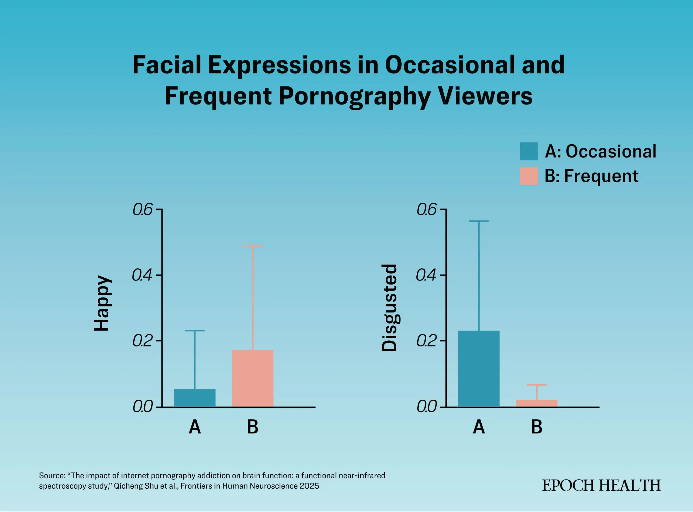

https://www.theepochtimes.com/health/pornography-pays-in-pleasure-but-taxes-your-brain-and-emotions-5881367

# How Pornography Taxes the Brain and Emotions

The new study, published in Frontiers in Human Neuroscience, gives insights into how frequent pornography use may rewire the brain.

By Arsh Sarao and Makai Allbert

7/17/2025

Updated:
7/20/2025

What begins as a choice to watch pornography can evolve into a neurological and physical battle, with new research showing that frequent viewing rewires the brain in ways that mirror drug addiction.

The new [study](https://www.frontiersin.org/journals/human-neuroscience/articles/10.3389/fnhum.2025.1477914/full), published in Frontiers in Human Neuroscience, gives insights into how frequent pornography use may rewire the brain’s reward and control circuits, leading to neurological arousal, behavioral changes, and possible dependency, comparable to that observed in opioid addicts.

## Obsession-Led Brain Rewiring

Conducted at Chengdu Medical College in China, the study involved 21 healthy college students who watched pornographic content to varying degrees and had no history of substance use. The participants were split into two groups: occasional, low-frequency pornography use, and those with a chronic obsession.

A 10-minute pornography video was selected for the experiment. Before and after watching the video, researchers measured participants’ cognitive functioning and reaction times. Further, while participants watched the video, their real-time neural activity, vital body signs, and facial expressions were also recorded.

The findings revealed that frequent pornography consumption creates three distinct changes in how our brains and bodies respond.

1. Brain Reward Circuits Get Hijacked

When the frequent porn users watched the video, their brain patterns showed features similar to people [addicted to drugs](https://www.nature.com/articles/nrn3119) such as cocaine or opioids, according to the researchers.

The brain areas associated with decision-making, self-control, and reward anticipation—the ventrolateral prefrontal cortex, dorsolateral prefrontal cortex, and frontopolar area, respectively—experienced enhanced connectivity. 
Such changes may lead the viewer to continue watching pornography, resulting in compulsive behavior, even prioritizing pornography over work, socializing, or other activities they used to enjoy.

Further, regular exposure to pornography leads to intense and sustained dopamine release, which in turn builds tolerance and desensitization. What used to arouse someone may no longer be sufficient, causing the person to seek more extreme content to experience the same level of feeling.

2. Emotional Responses Mirror Drug Use

Beyond neurological changes, the study also found that the emotional reactions in porn users resembled those observed in drug addiction.

For example, opioid users experience intense calmness, euphoria, pain relief, and a sense of blurred perception, which leads to a decreased heart rate. Similarly, researchers noticed that participants watching pornography had decreased heart rate, with the frequent pornography users exhibiting a more pronounced drop.

The emotional facial expressions while watching the 10-minute video revealed even more telling patterns. Frequent porn watchers displayed heightened facial expressions of pleasure and happiness, similar to the euphoria reported by drug users.

However, they also displayed significantly more anger and sadness than infrequent watchers, suggesting greater emotional fluctuations within the frequent group. According to the researchers, these emotional ups and downs may stem from conflicting feelings of arousal, withdrawal-like distress, and impaired emotional control in the brain.

Most concerning, frequent porn watchers were less surprised and had more numb expressions, similar to the intense calmness caused by opioid drugs. Further, this group showed higher anxiety and depression.

In contrast, the casual porn watchers showed more expressions of disgust and fear, which the researchers suggest may indicate they were less immersed and less emotionally blunted. This pattern implies they retained a more typical defensive reaction to explicit content.

3. Clouded Thinking

Cognitive function is also [significantly affected](https://www.theepochtimes.com/health/men-are-losing-the-battle-against-their-own-pleasure-5760537) by pornography use. The study measured participants’ accuracy and reaction times in completing a color and word test before and after the viewing session and found that chronic porn users had a greater decline in both.

The results highlight how frequent pornography watching may hijack a person’s ability to regulate attention and make sober judgments.

## The Question of Addiction

The study’s findings raise important questions about how to interpret the observed brain changes. Nicholas Borgogna, an assistant professor at the University of Alabama at Birmingham who specializes in addiction and sexual health, cautions against jumping to conclusions about “pornography addiction.”

Borgogna, who was not associated with the study, told The Epoch Times that there’s a debate over whether people who develop pornography problems from failed impulse control should be considered “addicted.”

He said that because sex is inherently one of the most reinforcing activities for humans, pornography can exploit this novelty and lead to impulse-control problems.

The Chengdu researchers noted that prolonged overactivation of the reward system could lead to “withdrawal reactions” such as anxiety, irritability, depression, and anger if one stopped watching pornography for an extended period.

However, there’s little evidence for true withdrawal reactions, Borgogna said. Someone who has looked at pornography every day for a year is probably not going to start vomiting and shaking from lack of pornography if they go without it for a few days. The brain is dynamic and constantly changing, suggesting that any effects may be reversible, he said.

On the other hand, John Foubert, dean of the College of Education at Union University and the former highly qualified expert for sexual assault prevention with the U.S. Army, supports the addiction framework to recognize and treat problematic pornography use.

Pornography addiction is just like a behavioral addiction to substance abuse or gambling, Foubert told The Epoch Times. “There’s very clear evidence that porn changes the brain.”

Though the use of pornography is a private matter, it does impact those around us, he said. For instance, his research found that the more people use pornography, the less likely they are to intervene to help prevent a sexual assault.

The idea that one should do whatever pleases them can easily lead one down an undesirable road, he said.

## Unlearn Pornography

Due to the brain’s neuroplasticity, it is possible to naturally rewire its pathways.

Psychotherapy is the main treatment for problematic pornography use.

Acceptance and Commitment Therapy (ACT), for example, shows particularly promising outcomes. An evidence-based form of psychotherapy, it focuses on observing and accepting negative thoughts and urges, being mindful of the present moment, and living purposefully.

To treat problematic pornography watching, ACT uses a technique called cognitive defusion—helping participants detach from their obsessive pornography-related thoughts by helping them identify priorities beyond porn cravings. Participants are guided to accept the urges without acting on them and stay committed to life’s bigger goals.

A 2016 randomized [clinical trial](https://pubmed.ncbi.nlm.nih.gov/27157029/) on ACT’s effectiveness showed remarkable results. Participants reported around a 92 percent reduction in pornography viewing after 12 therapy sessions, and 54 percent completely stopped viewing pornography post-treatment.

Additionally, integrating holistic approaches, such as meditation practices, can help reduce distressing emotions and foster greater self-awareness.

Ultimately, overcoming porn cravings may be less about restricting viewing. The key lies in “looking beyond oneself and pursuing something that’s bigger,” Foubert said.
