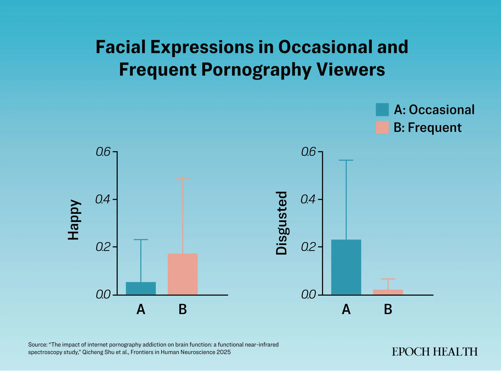

https://www.theepochtimes.com/health/pornography-pays-in-pleasure-but-taxes-your-brain-and-emotions-5881367

# Jak pornografia obciąża mózg i emocje

Nowe badanie opublikowane w „Frontiers in Human Neuroscience” pokazuje, jak częste oglądanie pornografii może przekształcać mózg.

Autorzy: Arsh Sarao i Makai Allbert  
Data: 17.07.2025  
Aktualizacja: 20.07.2025

To, co zaczyna się jako świadomy wybór oglądania pornografii, może przekształcić się w neurologiczną i fizyczną walkę. Nowe badania pokazują, że częste oglądanie pornografii przebudowuje mózg w sposób podobny do uzależnienia od narkotyków.

Nowe [badanie](https://www.frontiersin.org/journals/human-neuroscience/articles/10.3389/fnhum.2025.1477914/full), opublikowane w „Frontiers in Human Neuroscience”, pokazuje, jak częste korzystanie z pornografii może zmieniać obwody nagrody i kontroli w mózgu, prowadząc do neurologicznego pobudzenia, zmian w zachowaniu oraz możliwej zależności, podobnej do tej obserwowanej u osób uzależnionych od opioidów.

## Przebudowa mózgu pod wpływem obsesji

Badanie przeprowadzono na Chengdu Medical College w Chinach, wzięło w nim udział 21 zdrowych studentów, którzy oglądali pornografię z różną częstotliwością i nie mieli historii używania substancji psychoaktywnych. Uczestników podzielono na dwie grupy: okazjonalnych, rzadko korzystających z pornografii oraz tych z chroniczną obsesją.

Do eksperymentu wybrano 10-minutowy film pornograficzny. Przed i po oglądaniu mierzono u uczestników funkcje poznawcze oraz czas reakcji. Podczas oglądania rejestrowano też ich aktywność nerwową w czasie rzeczywistym, podstawowe parametry życiowe i mimikę twarzy.

Wyniki pokazały, że częste oglądanie pornografii wywołuje trzy wyraźne zmiany w reakcji mózgu i ciała.

### 1. Przejęcie przez mózg obwodów nagrody

U osób często oglądających pornografię wzorce mózgowe podczas oglądania filmu przypominały te u osób uzależnionych od narkotyków takich jak kokaina czy opioidy.

Obszary mózgu odpowiedzialne za podejmowanie decyzji, samokontrolę i oczekiwanie nagrody — odpowiednio: kora przedczołowa brzuszno-boczna, grzbietowo-boczna i obszar frontopolarowy — wykazywały zwiększoną łączność.  
Takie zmiany mogą powodować, że osoba będzie kontynuować oglądanie pornografii kompulsywnie, nawet kosztem pracy, życia towarzyskiego czy innych dotychczasowych aktywności.

Dodatkowo, regularna ekspozycja na pornografię wywołuje intensywne i długotrwałe uwalnianie dopaminy, co prowadzi do rozwoju tolerancji i znieczulenia na bodźce. To, co kiedyś działało pobudzająco, przestaje wystarczać, więc osoba szuka coraz bardziej ekstremalnych treści, by uzyskać ten sam poziom odczuwania.

### 2. Emocjonalne reakcje podobne do tych w uzależnieniu od narkotyków

Poza zmianami neurologicznymi badanie wykazało, że emocjonalne reakcje u oglądających pornografię przypominają te u osób uzależnionych od narkotyków.

Na przykład użytkownicy opioidów doświadczają intensywnego uspokojenia, euforii, ulgi w bólu i zaburzenia percepcji, co prowadzi do spadku tętna. Podobnie u uczestników oglądających pornografię zaobserwowano spadek tętna, a u częstych oglądających ten spadek był jeszcze bardziej wyraźny.

Mimika twarzy podczas oglądania 10-minutowego filmu ujawniła jeszcze ciekawsze wzorce. Często oglądający pornografię wykazywali silne wyrazy przyjemności i szczęścia, podobne do euforii u narkomanów.

Jednak również wykazywali dużo więcej złości i smutku niż osoby oglądające rzadziej, co sugeruje większe wahania emocjonalne w tej grupie. Według badaczy te emocjonalne wzloty i upadki mogą wynikać z konfliktu pomiędzy pobudzeniem seksualnym, stanami przypominającymi odstawienie oraz upośledzoną kontrolą emocji w mózgu.

Najbardziej niepokojące jest to, że często oglądający wykazywali mniejszą zdolność do zaskoczenia i bardziej obojętną mimikę, podobną do intensywnego spokoju wywoływanego przez opioidy. Ta grupa także miała wyższy poziom lęku i depresji.

Dla kontrastu, osoby okazjonalnie oglądające pornografię pokazywały więcej wyrazów obrzydzenia i strachu, co może wskazywać, że nie były tak bardzo zanurzone w treści i nie były tak emocjonalnie znieczulone. Wzorzec ten sugeruje, że zachowały bardziej typową reakcję obronną na treści eksplicytne.

### 3. Zaburzenia myślenia

Funkcje poznawcze również są znacznie zaburzone przez korzystanie z pornografii. W badaniu mierzono dokładność i czas reakcji uczestników podczas testu koloru i słowa przed i po sesji oglądania. U osób z chronicznym korzystaniem z pornografii zanotowano większy spadek obu wyników.

Wyniki podkreślają, jak częste oglądanie pornografii może zaburzać zdolność regulacji uwagi i podejmowania trzeźwych decyzji.

## Pytanie o uzależnienie

Wyniki badania rodzą ważne pytania, jak interpretować zaobserwowane zmiany w mózgu. Nicholas Borgogna, adiunkt Uniwersytetu Alabamy w Birmingham, specjalista ds. uzależnień i zdrowia seksualnego, ostrzega przed zbyt szybkim nazywaniem tego „uzależnieniem od pornografii”.

Borgogna, niezwiązany z badaniem, powiedział The Epoch Times, że toczy się debata, czy osoby z problemami kontroli impulsów wobec pornografii powinny być nazywane „uzależnionymi”.

Ponieważ seks jest jedną z najbardziej nagradzających aktywności dla człowieka, pornografia może wykorzystać tę nowość i prowadzić do problemów z kontrolą impulsów.

Badacze z Chengdu zauważyli, że długotrwałe nadmierne pobudzenie systemu nagrody może prowadzić do „reakcji odstawienia” takich jak lęk, drażliwość, depresja i złość, gdy ktoś przestaje oglądać pornografię przez dłuższy czas.

Jednak Borgogna zaznacza, że istnieje niewiele dowodów na prawdziwe reakcje odstawienia. Osoba, która codziennie oglądała pornografię przez rok, raczej nie zacznie wymiotować i drżeć, jeśli przez kilka dni nie będzie jej oglądać. Mózg jest dynamiczny i stale się zmienia, co sugeruje, że efekty mogą być odwracalne.

Z drugiej strony John Foubert, dziekan Wydziału Edukacji na Union University i były ekspert ds. zapobiegania napaściom seksualnym w armii USA, popiera klasyfikowanie problematycznego korzystania z pornografii jako uzależnienia.

„Uzależnienie od pornografii jest jak uzależnienie behawioralne, podobne do nadużywania substancji lub hazardu” — powiedział Foubert dla The Epoch Times. „Istnieją bardzo wyraźne dowody na to, że pornografia zmienia mózg.”

Choć korzystanie z pornografii jest sprawą prywatną, ma wpływ na otoczenie. Na przykład jego badania wykazały, że im więcej ktoś korzysta z pornografii, tym mniejsza jest jego skłonność do interwencji, aby zapobiec napaści seksualnej.

Idea, że można robić wszystko, co się podoba, może łatwo prowadzić na niepożądaną ścieżkę, dodał.

## Oduczyć się pornografii

Dzięki neuroplastyczności mózgu możliwe jest naturalne przebudowanie jego ścieżek.

Psychoterapia jest główną formą leczenia problematycznego korzystania z pornografii.

Terapia Akceptacji i Zaangażowania (ACT) daje szczególnie obiecujące rezultaty. To oparta na dowodach forma psychoterapii, która skupia się na obserwowaniu i akceptacji negatywnych myśli i impulsów, uważności na chwile obecne oraz życiu zgodnie z wartościami.

W leczeniu problematycznego oglądania pornografii ACT stosuje technikę defuzji poznawczej — pomaga uczestnikom zdystansować się od obsesyjnych myśli związanych z pornografią, identyfikując ważniejsze cele życiowe poza pragnieniami związanymi z pornografią. Uczestnicy uczą się akceptować impulsy bez ich realizowania i pozostawać zaangażowani w większe cele życiowe.

Losowe badanie kliniczne z 2016 roku wykazało znakomite efekty — uczestnicy zgłaszali około 92% redukcję oglądania pornografii po 12 sesjach terapii, a 54% całkowicie przestało ją oglądać po leczeniu.

Dodatkowo, integracja podejść holistycznych, takich jak medytacja, pomaga zmniejszyć negatywne emocje i zwiększyć samoświadomość.

Ostatecznie przezwyciężanie pragnień oglądania pornografii może nie polegać na samym zakazie oglądania. Kluczem jest „patrzenie poza siebie i dążenie do czegoś większego”, podsumował Foubert.
